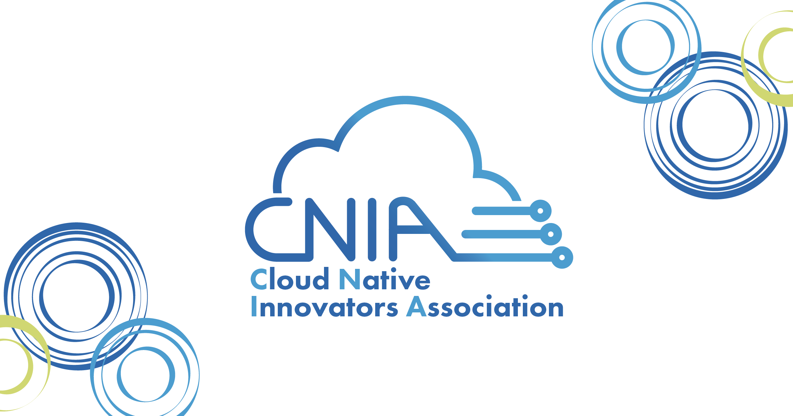

# 一般社団法人クラウドネイティブイノベーターズ協会 (CNIA)

[](https://cnia.io)

CNIA (Cloud Native Innovators Association) は、クラウドネイティブ技術の普及と発展を目的とした一般社団法人です。
Platform Engineering Meetup (PFEM) や Platform Engineering Kaigi (PEK) などのイベントを運営しています。

## CNIAについて

CNIAは、クラウドネイティブ技術に関わる人々が集まり、知識や経験を共有し、共に成長できるコミュニティを目指しています。
技術的な情報発信だけでなく、企業間の連携や人材育成にも力を入れています。

## Platform Engineering Meetup (PFEM)

PFEMは、CNIAが運営するPlatform Engineeringに関するミートアップです。
Platform Engineeringに興味のあるエンジニアや、実際にPlatform Engineeringに取り組んでいるエンジニアが集まり、事例発表や技術的な議論を行います。

[PFEMのウェブサイトはこちら](https://cnia.io/pfem/)

## Platform Engineering Kaigi (PEK)

PEKは、CNIAが運営するPlatform Engineeringに関するカンファレンスです。
国内外のPlatform Engineeringの専門家が集まり、最新の技術動向や事例について発表します。

[PEKのウェブサイトはこちら](https://cnia.io/pek2024/)

## ウェブサイトについて

このウェブサイトは、以下の技術を用いて構築されています。

*   [Astro](https://astro.build/)
*   [Tailwind CSS](https://tailwindcss.com/)

### ディレクトリ構成

```
.
├── public/          # 静的ファイル (画像など)
├── src/             # ソースコード
│   ├── assets/      # アセットファイル (画像、スタイルシートなど)
│   ├── components/  # Astroコンポーネント
│   ├── content/     # コンテンツ (ブログ記事など)
│   ├── layouts/     # レイアウト
│   ├── pages/       # ページ
│   ├── utils/       # ユーティリティ関数
├── package.json     # パッケージ情報
├── astro.config.mjs # Astroの設定ファイル
└── ...
```

各ディレクトリの説明:

*   `public/`: ウェブサイトで利用する静的なファイルを格納します。
*   `src/`: ウェブサイトのソースコードを格納します。
*   `src/assets/`: 画像やスタイルシートなどのアセットファイルを格納します。
*   `src/components/`: Astroコンポーネントを格納します。
*   `src/content/`: ブログ記事などのコンテンツを格納します。
*   `src/layouts/`: ページのレイアウトを定義します。
*   `src/pages/`: ページを定義します。
*   `src/utils/`: ユーティリティ関数を格納します。
*   `package.json`: プロジェクトの依存関係やスクリプトを定義します。
*   `astro.config.mjs`: Astroの設定を記述します。

## ライセンス

このウェブサイトは、MITライセンスで公開されています。
詳しくは、[LICENSE.md](LICENSE.md)をご覧ください。
