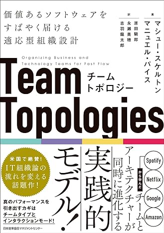
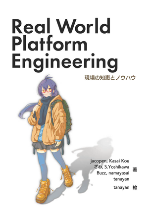
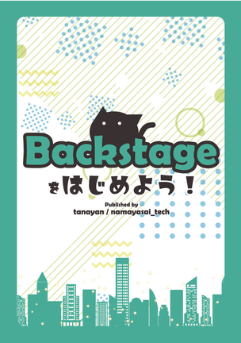
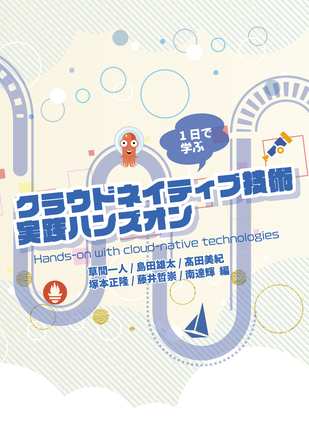
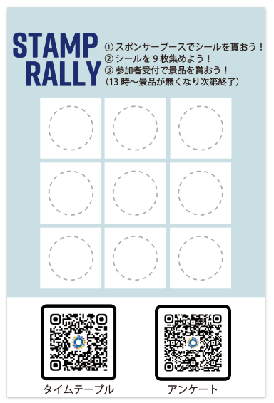

Platform Engineering Kaigi 2024の開催もいよいよ来週にせまってまいりました 😃

今回は、現地会場でご用意している各種企画についてご紹介します！

## Manuel Paisさんサイン会

PEK2024の目玉はなんといってもTeam Topologiesの著者であるManuel Paisさんのキーノート！  
Platform EngineeringはTeam Topologiesとは切っても切れない関係になっており、Manuelさんの話を聞けるということは、Platform Engineeringの神髄を聞けると言っても過言ではありません。

なので、みなさまには是非Team Topologiesの書籍を購入いただきたいと思っています。  
なお、現地での書籍販売も検討中です✨

Amazonでの購入はこちら ([チームトポロジー 価値あるソフトウェアをすばやく届ける適応型組織設計](https://www.amazon.co.jp/%E3%83%81%E3%83%BC%E3%83%A0%E3%83%88%E3%83%9D%E3%83%AD%E3%82%B8%E3%83%BC-%E4%BE%A1%E5%80%A4%E3%81%82%E3%82%8B%E3%82%BD%E3%83%95%E3%83%88%E3%82%A6%E3%82%A7%E3%82%A2%E3%82%92%E3%81%99%E3%81%B0%E3%82%84%E3%81%8F%E5%B1%8A%E3%81%91%E3%82%8B%E9%81%A9%E5%BF%9C%E5%9E%8B%E7%B5%84%E7%B9%94%E8%A8%AD%E8%A8%88-%E3%83%9E%E3%82%B7%E3%83%A5%E3%83%BC%E3%83%BB%E3%82%B9%E3%82%B1%E3%83%AB%E3%83%88%E3%83%B3/dp/4820729632))

さらに嬉しいニュースとして、Manuelさんのご登壇の後にサイン会を開催することとなりました！ 🖊  
現地参加される方は、是非Team Topologiesの書籍をお持ちください。

### サイン会日時

7/9 11:50〜12:15 (イベントの進行により前後する可能性あり)  
場所: TrackA会場 窓側

## 書籍販売

技術書博覧会・技術書典で好評いただいた、運営メンバーが執筆した以下の同人誌も販売します。  
お買い求めの際の決済方法は **現金不可、キャッシュレス決済※のみ** となりますのでご注意ください！  
※対応決済方法: 各クレジットカードブランドのタッチ決済、QUICPay、ID、交通系電子マネー

**【Real World Platform Engineering: 現場の知恵とノウハウ】**

7名の執筆担当が直面した Platform Engineering の課題とその解決法に対する考え方や実践例などがまとめられています。
皆様のPlatform Engineeringジャーニーのおともにいかがでしょうか。

物理本が若干数と、電子書籍を販売予定です。

**【Backstageをはじめよう！】**

Platform Engineeringの中で提唱されている内部開発者ポータル（Internal Developer Portal、IDP）の代表的なツールであるBackstageについて、構築・拡張のための基礎知識が詰まった一冊です。社内で開発者ポータルを構築しようと考えられている方にオススメです！

こちらは残念ながら物理本は品切れで、電子書籍のみの販売となります。

**【クラウドネイティブ技術実践ハンズオン】**

Platform Engineering Kaigi の協力イベントである CloudNative Days の運営チームが執筆した本です。  
昨今話題のPrometheus・Grafana・OpenTelemetry・Argo CD・Argo Rollouts・Istio・Cilium・Hubble といったクラウドネイティブなOSSについて、ハンズオン形式で学べる本です。

こちらも電子書籍のみの販売です。

ご興味ございましたらぜひ書籍販売コーナーにもお立ち寄りください。

## スタンプラリー

会場ではスタンプラリーを開催します！🏃💨  
スタンプはスポンサーブースを回るとGETできます。9個集めると、豪華景品が貰えるチャンス！

スポンサー各社さまざまな出展をされていますので、休憩時間は是非スポンサーブースへお越しください！

## フォトブース

受付入口から入って左手にはフォトブースを設置しています。  
幅2m40cm 高さ2m のフォトブースが皆さんをお出迎えします。

カンファレンス参加の記念に一枚！ 📷✨ お写真いかがでしょうか？

撮った写真をSNSに投稿して、一緒にカンファレンスを盛り上げていただけると嬉しいです！

## まとめ

ということで、企画盛りだくさんのPlatform Engineering Kaigi 2024。現地会場にご参加頂ける方は是非楽しんでいただければと思います。

また、本イベントはオンラインでも参加可能です。オンラインの場合はこれらの企画には参加できませんが(物理の壁…) 、本当に役立つセッションばかり揃えておりますので、是非参加してみなさまのPlatform Engineering道にお役立てください。  
参加登録、まだ間に合いますよ！

[参加登録はこちらから](https://www.cnia.io/pek2024/)
