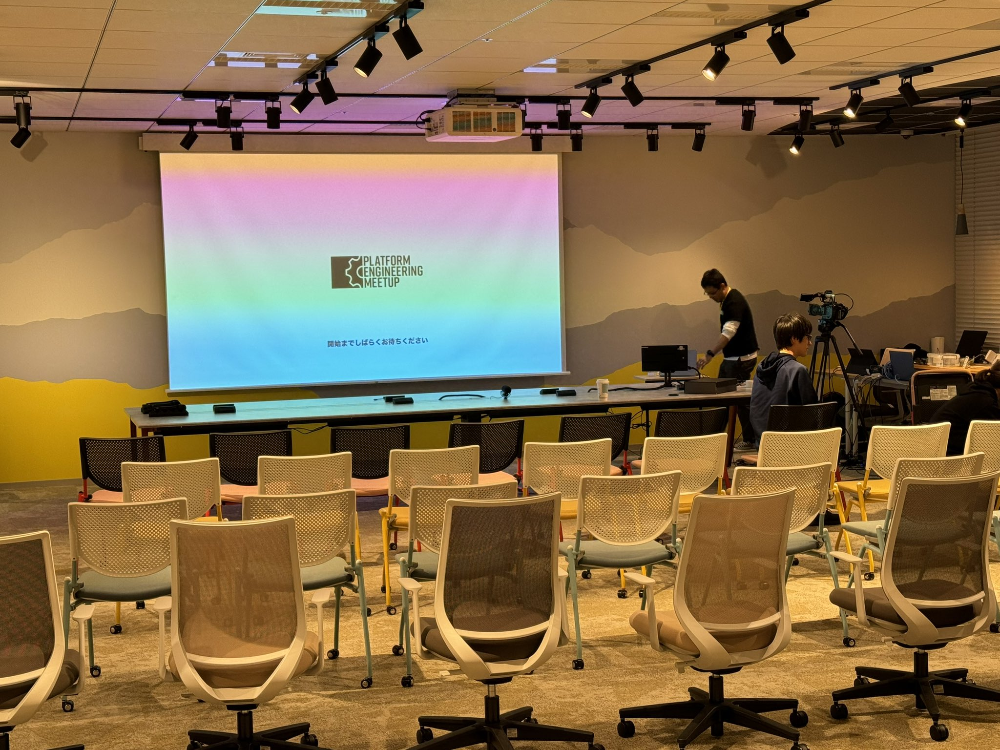
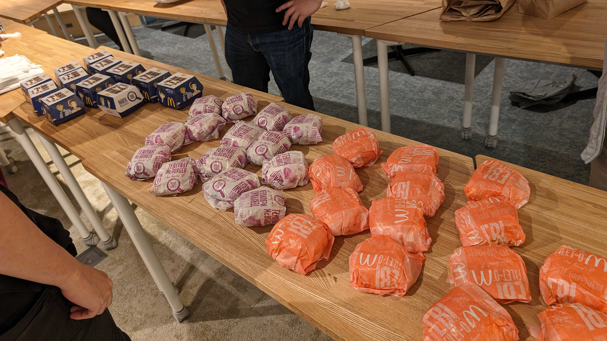

# Platform Engineering Meetup #8レポート

## はじめに

4/19(金)に開催されたPlatform Engineering Meetup #8の参加レポートをお送りします。今回は初の大阪での開催、ということで関西でPlatform Engineeringが気になっているエンジニアのみなさんにとってはお待ちかね！だったんじゃないかなと思います。

## テーマ

今回は特にテーマはなく、いろんな視点のお話がありました。詳しくはのちほど。

## 会場

JR大阪駅直結のグランフロント、にあるアールスリーインスティテュートさんのコミュニティスペース、gusuku Ashibinaa OSAKAをお借りしました。個人的にはJAWSのイベントなどでお邪魔したりしていたので馴染み深い場所です。アクセスもよく、数十人規模で利用可能なのでいろんな勉強会で利用されているのを観測しています。

## セッション

それではセッションのレポートです。

### ChatworkのSRE部って実は半分くらいPlatform Engineering部かもしれない

内容としてはかなりタイトルが物語っていて、ChatworkのSRE部が今までやってきたことって、改めて考えてみるとPlatform Engineeringだったのかも、という近年の気付きについて発表させていただきました。開発者用のPR環境を運用している話を例にしつつ、また今後の展望としてPlatform Engineeringの考え方を使って開発者の人にヒアリングを進めていきたい、というお話でした。

<iframe class="speakerdeck-iframe" frameborder="0" src="https://speakerdeck.com/player/66ff0884adf14862b6019fc4bcc5c5f6" title="ChatworkのSRE部って実は 半分くらいPlatform Engineering部かもしれない" allowfullscreen="true" style="border: 0px; background: padding-box padding-box rgba(0, 0, 0, 0.1); margin: 0px; padding: 0px; border-radius: 6px; box-shadow: rgba(0, 0, 0, 0.2) 0px 5px 40px; width: 100%; height: auto; aspect-ratio: 560 / 315;" data-ratio="1.7777777777777777"></iframe>

### はてなにおけるメール基盤とDMARC対応

はてなのPlatform SREをされている @MysticDoll さんのおはなし。システムプラットフォームチームの責務としてメール基盤の運用がありその中でのDMARC対応について発表いただきました。ECS Anywhereを使うなど技術的なところもしっかり抑えつつ、でもやっぱり最後は地道な作業も行ったりとX上でもあるあるの声がたくさんありました。

<iframe class="speakerdeck-iframe" frameborder="0" src="https://speakerdeck.com/player/573ebde7645141f9b15d34c637371033" title="はてなにおけるメール基盤とDMARC対応" allowfullscreen="true" style="border: 0px; background: padding-box padding-box rgba(0, 0, 0, 0.1); margin: 0px; padding: 0px; border-radius: 6px; box-shadow: rgba(0, 0, 0, 0.2) 0px 5px 40px; width: 100%; height: auto; aspect-ratio: 560 / 315;" data-ratio="1.7777777777777777"></iframe>

### プラットフォームってつくることより計測できることが重要なんじゃないかという話

コドモンでSREをされている佐々木さんのおはなし。プラットフォームを作ったはいいけれど、本当にちゃんと使われているのか？など、作ったあとの計測が大事だよという内容について発表いただきました。メトリクスをとったりアンケートをとったりして、それが意図した状態と乖離しているのであれば、開発者の人に知ってもらえるようにしたりすることで改善されたとのことです。

<iframe class="speakerdeck-iframe" frameborder="0" src="https://speakerdeck.com/player/e1ec178de2c040309d9ddac894f9a3dc" title="プラットフォームってつくることより計測することが重要なんじゃないかという話 / Platform Engineering Meetup #8" allowfullscreen="true" style="border: 0px; background: padding-box padding-box rgba(0, 0, 0, 0.1); margin: 0px; padding: 0px; border-radius: 6px; box-shadow: rgba(0, 0, 0, 0.2) 0px 5px 40px; width: 100%; height: auto; aspect-ratio: 560 / 315;" data-ratio="1.7777777777777777"></iframe>

## 懇親会

会場でそのまま懇親会へ。メインは油淋鶏チーズチキンタツタ。

話をしていると、プラットフォームを運用しているエンジニアの人や、逆にプラットフォームを利用する側である開発者の方など様々な方が参加されており、改めてPlatform Engineeringへの注目度が各方面で高まっているのを肌で感じることができました。

## さいごに

ということで盛況のうちに大阪会が終了しました。また次回のPFEMが楽しみなところはありますが、まずは！7/9(火)のPlatform Engineering Kaigi 2024がありますのでそちらもぜひお楽しみに！

https://www.cnia.io/pek2024/
