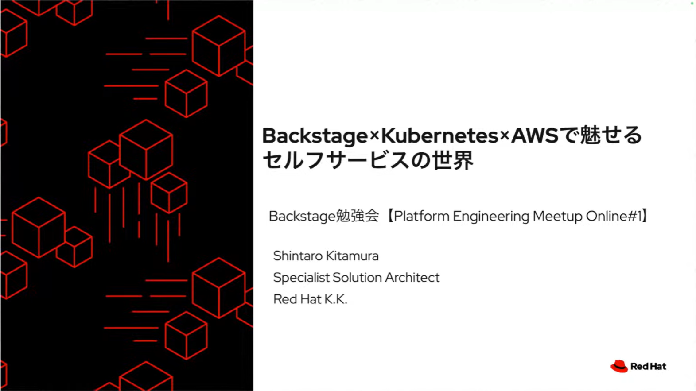
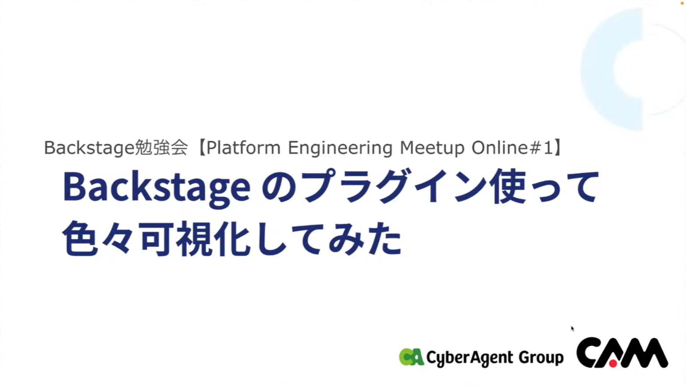

# Platform Engineering Meetup Online#1 開催レポート

## はじめに

2024/03/22(金)に開催した [Platform Engineering Meetup Online#1](https://platformengineering.connpass.com/event/311665/) の開催レポートをお送りします。  
通常のPlatform Engineering Meetupは現地＋オンライン配信のハイブリッド形式で開催していますが、本編のスピンオフ的な位置づけのイベントとしてオンラインのみのMeetupとして始めました。

YouTubeでアーカイブ配信も行っておりますので、まだご覧になっていない方はぜひご覧ください。

[Backstage勉強会【Platform Engineering Meetup Online#1】](https://www.youtube.com/watch?v=koMsUFOar88)

## テーマ

オンライン開催第1回目として、**Backstage勉強会** というテーマを選定しました。  
これまでのMeetupでは、先行してPlatform Engineeringに取り組まれている方のお話を聞くことが多かったのですが、今回はあえてツールにフォーカスを当てて、Backstageの使い方や導入事例についてをお届けすることとしました。
Platform Engineeringは特定のツールを使うことが目的ではなく、そのツールを使ってどのようにプラットフォームを構築し、運用していくかが重要です。
とはいえ、Backstageは最近注目されているツールであり、その導入事例や使い方を知ることは、Platform Engineeringに取り組む上での参考になると考えました。  
結果としては、まだ日本語での情報の少ないBackstageについて熱く語っていただける方々が集まり、視聴者の皆様にとっても有益なイベントになったのではと思います。

## セッション

では、どんなセッションがあったのかを簡単にご紹介します。

### Hello World, Backstage！

トップバッターを飾っていただいたのは、「Backstageとは何か」という内容を語っていただいた田中さんです。  
本イベントのオープニングにふさわしく、Platform EngineeringにおけるGoleden Pathの重要性や、Backstageの基本的な概念について、わかりやすく解説していただきました。

### 入門Backstage：System Modelの理解と活用方法

2本目のセッションでは、小泉さんよりBackstageの内部データ構造概念であるSystem Modelについて解説していただきました。
Backstageのコア機能であるSoftware Catalogにおいて、登録するエンティティの種類やその依存関係の表現方法、さらには現場で有用なTipsとしてTerraformのStateファイルからの登録方法についてもご紹介いただきました。

### Backstage×Kubernetes×AWSで魅せるセルフサービスの世界

3本目のセッションでは、北村さんによるAWS上のKubernetesとBackstageを連携させるGolden Pathをご紹介いただきました。
Terraformでのインフラ作成やArgoCDを用いたGitOpsの実現例について詳細に解説いただき、最後にはテンプレート作成における勘所についても触れていただきました。

### Backstage のプラグイン使って色々可視化してみた

4本目は、岡さんによるプラグインの活用方法についてのセッションです。
Backstageのプラグイン機構の内部構造について解説いただき、さらには実際にプラグインを用いて可視化に役立てている事例について語っていただきました。

### OPA(Orchestrate Platforms and Applications)on AWSの活用について

最後のセッションは、山名さんによるOPA on AWSの紹介です。
AWSのリソース作成に特化したプラグイン・テンプレートをあらかじめ組み込んで提供されているOPA on AWSについて、実際の画面を使ったデモを交え詳細に解説いただきました。

## おわりに

初の試みであるオンライン限定Meetupでしたが、SNSやYouTubeのコメントを見ると皆様に楽しんでいただけたようで、私たち運営メンバーもとても嬉しく思います。  
今後もハイブリッド形式のMeetupと並行し、オンラインMeeupも継続して開催していく予定です。

7/9(火)にはPlatform Engineering Kaigi 2024を開催します。こちらもぜひご参加ください！

https://www.cnia.io/pek2024/
