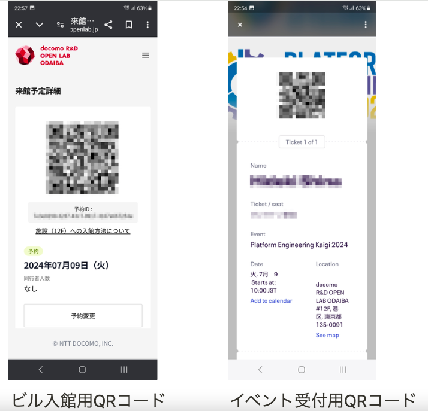

Platform Engineering Kaigi 2024 を現地でスムーズに最大限楽しんでいただくために、参加者の皆様に事前にご準備をお願いしたいことがあります。このブログではその中でも特に、ビルへの入館と受付に関する重要な点に絞ってお伝えさせていただこうと思います！

## 時間のない方にむけて３行で

- ビルへの入館用QRコードとカンファレンス受付用QRコードの２種類の事前準備をお願いします。
- 「Team Topologies」の共著者の方によるサイン会が予定されておりますので、物理本をお持ちの方はご持参を！
- [一般参加者ガイド](https://www.notion.so/Platform-Engineering-Kaigi-2024-ebb1a45a5f4444be90e9293fecdc18d3)にその他必要な情報がまとまってますので、ご一読をお願いします。

## 入館と受付の２種類のQRコードのご準備を

会場となる [docomo R&D OPEN LAB ODAIBA](https://docomo-openlab.jp/) への入退館時と、12Fでのカンファレンス受付時にそれぞれ別々のQRコードが必要となります。

来場者の方々にはお手数ですが、[docomo R&D OPEN LAB ODAIBA](https://app.docomo-openlab.jp/)への会員登録後、カンファレンス当日（2024年7月9日）の来館予約をしていただき、予めビルの入退館用QRコードの発行をお願いします。詳しくは[一般参加者ガイド＞（１）docomo R&D OPEN LAB ODAIBA への入館](https://pfem.notion.site/Platform-Engineering-Kaigi-2024-ebb1a45a5f4444be90e9293fecdc18d3#64382b81b04042e4aabeafcf143bb417) を参照ください。

またカンファレンス受付時には、EventBriteでご購入頂いたチケットのQRコードが必要になりますので、予めご準備のほどよろしくお願いします。

## Team Topologies 物理本をお持ちの方はぜひご持参を！

カンファレンスの最初のKeynoteに、「Team Topologies」の共著者のお一人であるManuel Pais氏をお迎えします。Manuel Pais氏による「Team Topologies」の本へのサイン会を、２つ目のKeynoteセッション終了後からランチセッションの開始前までの間で予定をしています。物理本をお持ちの方は、ぜひ会場にご持参ください。共著者の方から貴重なサインをいただけるこの機会をお見逃しなく！

私も１冊持ってますので、サインをいただけることを楽しみにしてます♪

## ビルへの入館方法

[docomo R&D OPEN LAB ODAIBA](https://app.docomo-openlab.jp/)の、ビル入退館用QRコード表示画面にある、「施設（12F）への入館方法について」というリンクに具体的な入館方法の説明がありますので、詳しくはそちらを参照いただきたいのですが、要点としては以下になります。

- ビルの１階または２階いずれかのゲートにQRコードをかざしてご入場ください。
- ゲート内にあるエレベータで１２階までお越しください。
- 退館時は１階または２階いずれかのゲートにQRコードをかざしてご退館ください。
- 再入館も可能です。

## カンファレンス受付方法

１２階でエレベータを降りていただくとすぐに受付があります。EventBriteのチケットのQRコードをご準備いただきお待ちいただくとスムーズに受付を完了することができますので、ご協力お願いします。

U25チケットをご購入された方につきましては、受付時に身分証にて生年月日を確認させていただきます。

また数に限りはございますが、ご希望の方には、Keynoteでの同時通訳をお聞きいただくためのレシーバーをお貸し出しする予定です。紛失を防ぐために、貸出の際にお名刺を頂戴する予定ですので、予めご用意のほどお願いします。

受付後、ネームカードを皆様にお渡ししますので、ご記入頂いた後、存分にカンファレンスをお楽しみください！

## さいごに

皆様にお願いばかりして大変恐縮ではありますが、このブログで触れられなかったことも含めてより詳細な情報が、[Platform Engineering Kaigi 2024 一般参加者ガイド（公開用）](https://www.notion.so/Platform-Engineering-Kaigi-2024-ebb1a45a5f4444be90e9293fecdc18d3?pvs=21) にございますので、ご一読をお願いします！

Platform Engineering Kaigi 2024 当日皆様にお会いできることを楽しみにしています！
